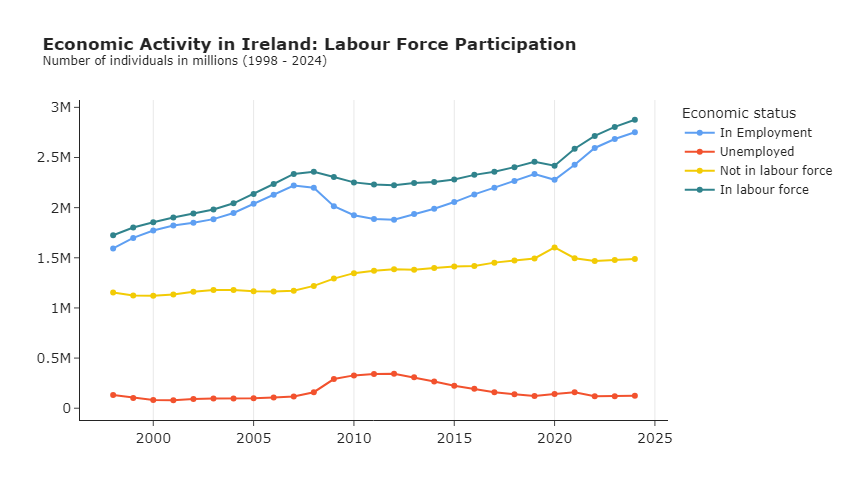
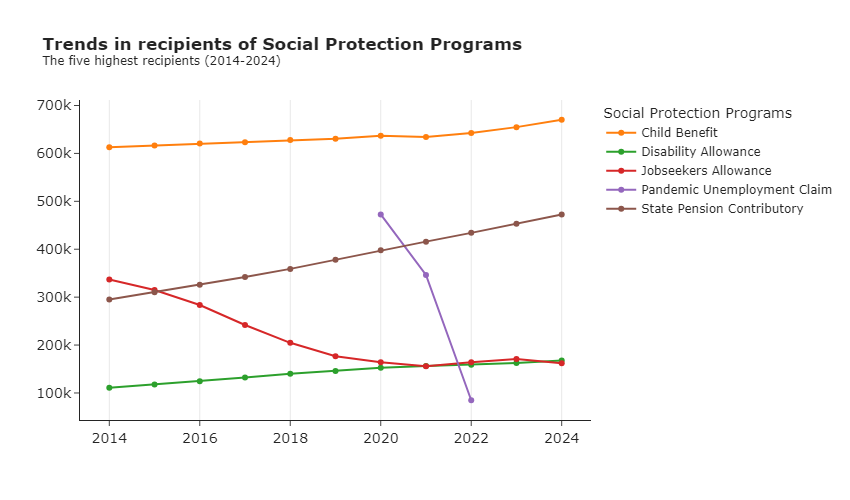
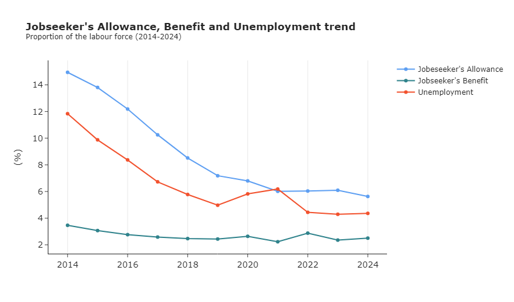
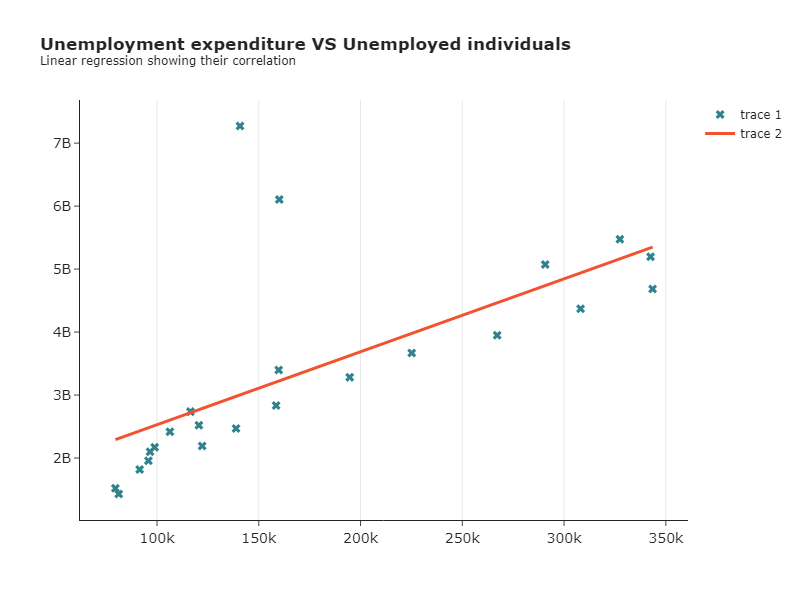

# Economic dynamics and policy impacts of Labour Force and Social Welfare in Ireland
 

## Project Overview
This project explores how labour force participation and social protection interact to shape Ireland’s economic health. Using open data from the CSO and the Department of Social Protection, I applied Python for data cleaning, preparation, and visualization to uncover key patterns in employment, unemployment, and welfare policies.

**For a deeper analysis download the python code here and report here.**

## Objectives

The project focused on four main questions:

- How have labour force participation, employment, and unemployment changed between 1998 and 2023? 
- What trends can be observed in social protection schemes, and are there disparities across counties? 
- How effective are Jobseeker programs in supporting the unemployed? 
- What is the relationship between unemployment expenditure and unemployment rates over time? 

## Data Sources

The analysis used three open datasets from the Central Statistics Office (CSO) and the Department of Social Protection:

- [**Labour Force Survey (CSO, Ireland)**](https://data.cso.ie/table/QLF01): Quarterly labour market data (ILO classification) from 1998–2024 for individuals aged 15+, including employment, unemployment, and participation rates.
- [**Welfare Recipients by Scheme and County (Department of Social Protection, Ireland)**](https://data.gov.ie/dataset/welfare-recipients-by-scheme-and-county): Quarterly counts of welfare recipients by scheme and county from 2014–2024 (Q3).
- [**Social Protection Expenditure (CSO, Ireland)**](https://data.cso.ie/table/SPEA02): Annual gross expenditure by category (e.g., unemployment, pensions, disability) covering 2000–2021.

## Tools
- **Python**: Used throughout the project for data preparation, analysis, and visualization. Key libraries included: 
    - **pandas** for data cleaning and manipulation; 
    - **matplotlib** and **seaborn**  for data visualization; 
    - **scipy** for statistical analysis.

## Analysis Techniques

1. **Descriptive statistics**: used .describe() and groupby() to summarize distributions and key measures.
2. **Data cleaning & transformation**: cleaned categorical variables, adjusted scales, and extracted year/period from time fields.
3. **Trend analysis**: visualized long-term changes in labour force participation, employment, unemployment, and social schemes.
4. **Regression analysis**: applied linear regression to project labour force growth and assess relationships.
5. **Statistical testing**: conducted Shapiro-Wilk test for normality and Kendall’s correlation for non-parametric relationships.
6. **Outlier analysis**: identified and evaluated extreme values, retaining them when meaningful.
7. **Data visualization**: created time-series plots, histograms, and boxplots to highlight trends, variability, and distributions.

## Data Cleaning & Transformation

1. Imported all datasets into pandas for inspection and preprocessing.
2. Filtered columns to retain only those relevant for analysis (e.g., time periods, categories, measures, values).
3. Extracted Year and Quarter/Period information from time-related columns for consistency across datasets.
4. Filtered categorical values to remove unnecessary or irrelevant entries (e.g., “both sexes” only, excluded “Unknown” and “All” counties).
5. Renamed columns and variables across datasets for clarity and standardization.
6. Adjusted data types and scales where needed.
7. Checked for data quality issues: missing values, duplicates and outliers.
8. Performed basic descriptive analysis (e.g., .describe(), groupby()) to understand distributions, variability, and key insights before deeper analysis.

## Analysis/Results
**1. Labour force trends (1998–2023)** 
Ireland’s labour market showed steady growth with clear dips during the 2008 crisis and COVID-19, followed by recovery. Projections suggest continued expansion but with a slight rise in unemployment and more people outside the labour force.

  

**2. Social protection programs (2014–2024)** 
Child Benefit remains the largest programs, pensions are rising with an aging population, and pandemic supports caused a temporary spike. Dublin consistently shows the highest and most variable demand.

  

**3. Jobseeker programs and unemployment** 
Jobseeker’s Allowance closely follows unemployment trends, acting as a key stabilizer, while Jobseeker’s Benefit plays a smaller, short-term support role. Together, they address different needs in the labour market.

  

**4. Expenditure and unemployment (2000–2022)**  
Spending on unemployment benefits strongly tracks unemployment levels, rising during crises and falling during recovery, showing the role of social protection in stabilizing Ireland’s economy.

  

## Autor
[Vinicius Carrarini](https://www.linkedin.com/in/viniciuscarrarini/)
