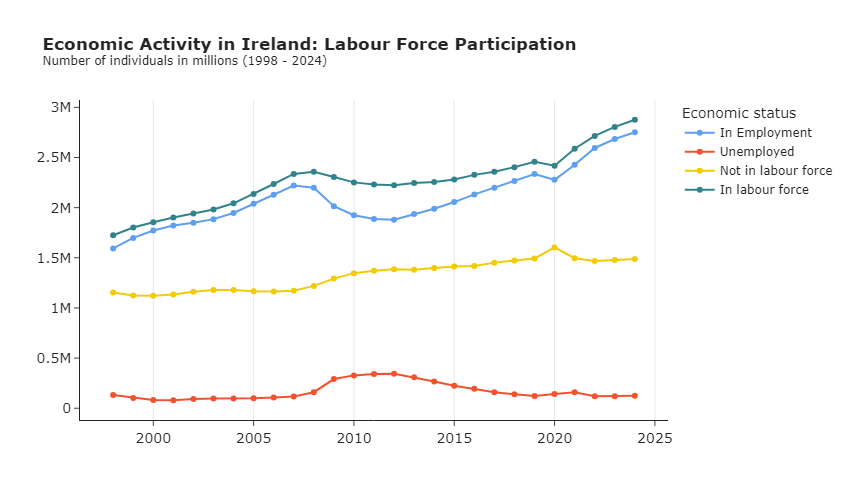
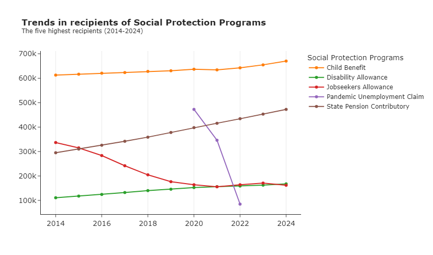
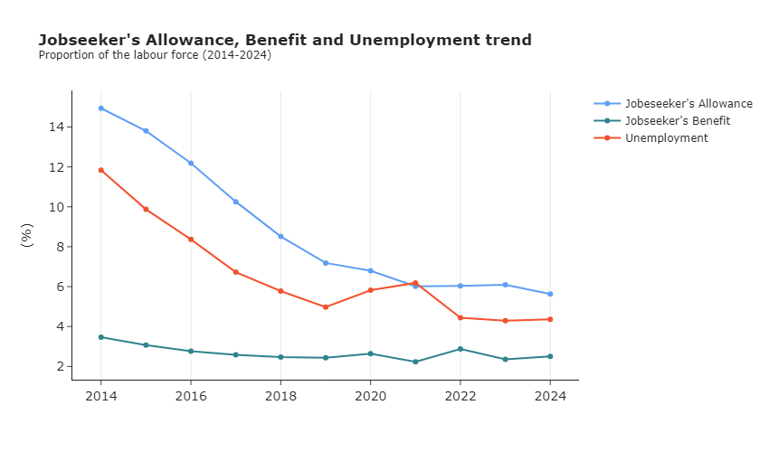
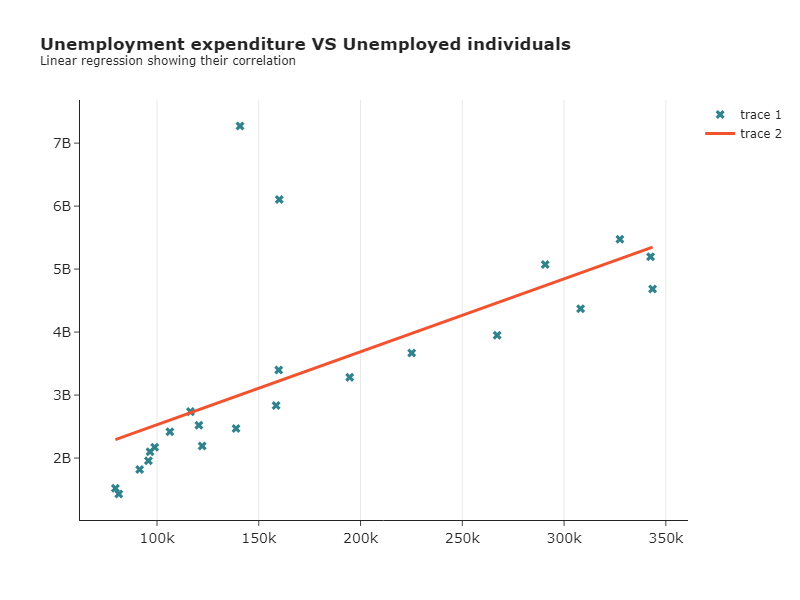

# Economic Dynamics and Policy Impacts of Labour Force and Social Welfare in Ireland

This project explores how labour force participation and social protection interact 
to shape Ireland's economic health. Using open data from the CSO and the Department 
of Social Protection, this study applies regression analysis, statistical hypothesis 
testing (Shapiro-Wilk, Kendall's correlation), and time-series visualization in Python 
to uncover how employment, unemployment, and welfare spending interact over time.

## Objectives

The project focused on four main questions:

1. How have labour force participation, employment, and unemployment changed between 1998 and 2023?
2. What trends can be observed in social protection schemes, and are there disparities across counties?
3. How effective are Jobseeker programs in supporting the unemployed?
4. What is the relationship between unemployment expenditure and unemployment rates over time?

## Data Sources

- [**Labour Force Survey (CSO, Ireland)**](https://data.cso.ie/table/QLF01) — 
  Quarterly labour market data (ILO classification) from 1998-2024 for individuals 
  aged 15+, including employment, unemployment, and participation rates.
- [**Welfare Recipients by Scheme and County (Department of Social Protection, Ireland)**](https://data.gov.ie/dataset/welfare-recipients-by-scheme-and-county) — 
  Quarterly counts of welfare recipients by scheme and county from 2014-2024 (Q3).
- [**Social Protection Expenditure (CSO, Ireland)**](https://data.cso.ie/table/SPEA02) — 
  Annual gross expenditure by category (e.g., unemployment, pensions, disability) 
  covering 2000-2021.

## Tools

Python 3.12, pandas, matplotlib, seaborn, scipy.

## Techniques

- Descriptive statistics
- Data cleaning & transformation (column filtering, type/scale adjustment, missing 
  values, duplicates, outlier checks)
- Trend analysis via time-series visualization
- Linear regression analysis
- Statistical testing (Shapiro-Wilk normality test, Kendall's correlation)
- Outlier analysis (retained when meaningful, rather than removed outright)

## Getting Started

*The notebooks and report can be viewed directly on GitHub — the steps below 
are only needed if you want to run the analysis yourself.*

**1. Download the repository:**
Click the green **Code** button at the top of this page, then select 
**Download ZIP**. Extract the folder to your computer.

**2. Install the dependencies:**
Open a terminal in the extracted folder and run:
```bash
pip install -r requirements.txt
```
**Requirements:** Python 3.12

**3. Download the datasets:**
This project uses three open datasets. Download each one from its source below, 
and place all three files in the `datasets/` folder:
- [Labour Force Survey (CSO, Ireland)](https://data.cso.ie/table/QLF01)
- [Welfare Recipients by Scheme and County (Department of Social Protection, Ireland)](https://data.gov.ie/dataset/welfare-recipients-by-scheme-and-county)
- [Social Protection Expenditure (CSO, Ireland)](https://data.cso.ie/table/SPEA02)

**4. Run the notebooks:**
Open the notebooks in [code/](https://github.com/vinikcabral/Labour-Force-Social-Welfare-in-Ireland-PYTHON/tree/main/code) 
using Jupyter Notebook or JupyterLab, and run them in order.

## Key Insights

- **Labour force trends (1998-2023)** — Ireland's labour market showed steady growth 
  with clear dips during the 2008 crisis and COVID-19, followed by recovery. 
  Projections suggest continued expansion, but with a slight rise in unemployment 
  and more people outside the labour force.
  <p align="left"></p>

- **Social protection programs (2014-2024)** — Child Benefit remains the largest 
  program, pensions are rising with an aging population, and pandemic supports 
  caused a temporary spike. Dublin consistently shows the highest and most variable 
  demand.
  <p align="left"></p>

- **Jobseeker programs and unemployment** — Jobseeker's Allowance closely follows 
  unemployment trends, acting as a key stabilizer, while Jobseeker's Benefit plays a 
  smaller, short-term support role. Together, they address different needs in the 
  labour market.
  <p align="left"></p>

- **Expenditure and unemployment (2000-2022)** — Spending on unemployment benefits 
  strongly tracks unemployment levels, rising during crises and falling during 
  recovery, showing the role of social protection in stabilizing Ireland's economy.
  <p align="left"></p>

## Full Report

See [Report.pdf](./Report.pdf) for the complete methodology and results, or the 
[code](./code) folder for the full analysis.

## Author

Vinicius Carrarini Cabral  
[LinkedIn](https://www.linkedin.com/in/viniciuscarrarini/) · [GitHub](https://github.com/vinikcabral)
